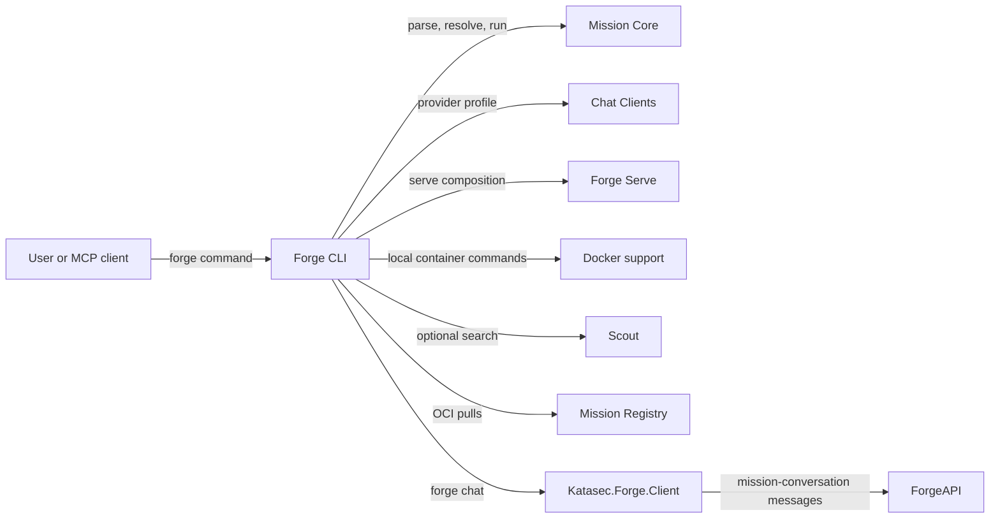

# Forge CLI

## Purpose

Exposes the `forge` executable and composes existing components into user-facing commands.

## Why this exists

One command surface connects mission setup, execution, serving, and chat. The CLI handles user
input and output; the components it calls own language semantics, provider protocols, and services.

## Owns

- Command registration, arguments, output, and mission-file selection.
- CLI wiring for OCI pulls, platform sign-in, built-in mission references, and MCP commands.
- `forge chat` startup and presentation: a full-screen terminal UI or line mode when piped.

## Does not own

- MCL parsing or execution, provider SDK adaptation, Docker operations, search, or HTTP wire mapping.
- Project and mission-authoring rules, durable conversation state, or Bob's capability authority;
  chat composes those services through `Katasec.Forge.Client` from
  [forge-client](https://github.com/katasec/forge-client).

## Change admission

Change this component for command behavior or composition. Change [Parser](../ForgeMission.Parser/README.md)
for syntax and [Core](../ForgeMission.Core/README.md) for resolution and execution. For provider
construction, Docker, search, or serving, change the corresponding component. Keep client-service
behavior in forge-client.

## Use these pieces

### Commands and chat setup

| Piece | Responsibility |
|---|---|
| [Program](Program.cs) | Executable entry point, command registration, and command handlers. |
| [ForgeExec](ForgeExec.cs) | One-shot hosted mission execution, artifact input/output, and ForgeAPI endpoint selection. |
| [PlatformLogin](PlatformLogin.cs) | Platform sign-in, key retrieval, `whoami`, and logout. |
| [ProviderClientBuilder](ProviderClientBuilder.cs) | Optional live-search wiring from xAI/Grok environment keys. |
| [ForgeProject](ForgeProject.cs) | Explicit portable Project creation and hosted Chat setup through the shared Client. |
| [ForgeChat](ForgeChat.cs) | Portable Project opening, hosted conversation reconnection, fresh hands approval/attachment, and terminal/line-mode selection. |
| [ChatHandsAttachment](ChatHandsAttachment.cs) | Executes file requests for an acknowledged hands attachment off the conversation follow loop. |
| [ForgeConfig](ForgeConfig.cs) | Reads the chat theme from `~/.forge/config.json`. |

### Terminal UI — [Tui/](Tui)

Built on XenoAtom.Terminal.UI.

| Piece | Responsibility |
|---|---|
| [ChatTui](Tui/ChatTui.cs) | UI loop, replay, submit/cancel, hands routing, screen swaps, and shutdown. |
| [ChatLink](Tui/ChatLink.cs) | Live-stream ownership, cursor, reconnect, idle sleep, and catch-up on wake. |
| [Transcript](Tui/Transcript.cs) | Event-to-block mapping for replay/live turns and duplicate final-reply suppression. |
| [ChatScreen](Tui/ChatScreen.cs), [ComposerEditor](Tui/ComposerEditor.cs) | Screen layout, composer sizing, and editor/start-page slots. |
| [StartPage](Tui/StartPage.cs) | Initial mission choices; **Chat with a mission** opens chat, **Create a mission** is a placeholder. |
| [EditFile](Tui/EditFile.cs), [FileEditor](Tui/FileEditor.cs) | `/edit <path>` rules and editor view; Ctrl+S saves, Esc closes or guards unsaved changes. |
| [ForgeTheme](Tui/ForgeTheme.cs), [ForgeStyles](Tui/ForgeStyles.cs) | Light/dark visual tokens and component styles. |
| [ForgeMarkdown](Tui/ForgeMarkdown.cs), [ForgeCodeBlockRenderer](Tui/ForgeCodeBlockRenderer.cs) | Markdown pipelines, image headings, and framed code blocks. |
| [Motion](Tui/Motion.cs), [FadeIn](Tui/FadeIn.cs), [StreamCaret](Tui/StreamCaret.cs), [LinkPointer](Tui/LinkPointer.cs) | Animation rules, changed-cell fade, streaming caret, and link feedback. |
| [TypeAhead](Tui/TypeAhead.cs), [TerminalCaret](Tui/TerminalCaret.cs), [TerminalPointer](Tui/TerminalPointer.cs) | Startup input cleanup and terminal cursor/pointer restoration. |
| [RawStdout](Tui/RawStdout.cs), [XenoCells](Tui/XenoCells.cs) | Isolated boundaries for raw escapes and XenoAtom internal access. |

### Graphics — [Tui/Graphics/](Tui/Graphics)

Shape and text images use kitty Unicode placeholder cells so normal terminal layout carries them.

| Piece | Responsibility |
|---|---|
| [TerminalFacts](Tui/Graphics/TerminalFacts.cs) | Terminal prerequisites and cell-size query. |
| [Raster](Tui/Graphics/Raster.cs), [Png](Tui/Graphics/Png.cs) | Shape rasterization and PNG encoding. |
| [RingGeometry](Tui/Graphics/RingGeometry.cs), [RingTiles](Tui/Graphics/RingTiles.cs), [CapTiles](Tui/Graphics/CapTiles.cs) | Cell-aligned frame geometry and pill caps. |
| [TileSet](Tui/Graphics/TileSet.cs), [TileFrame](Tui/Graphics/TileFrame.cs), [ScreenTiles](Tui/ScreenTiles.cs) | Image sets, frames around content, and the screen's tile registry. |
| [KittyImages](Tui/Graphics/KittyImages.cs) | Image transmission and placeholder encoding, written through `RawStdout`. |
| [GlyphText](Tui/Graphics/GlyphText.cs), [GposKerning](Tui/Graphics/GposKerning.cs), [TextArt](Tui/Graphics/TextArt.cs) | Font metrics, kerning, allowed image text, and text rasterization. |
| [TextImages](Tui/Graphics/TextImages.cs), [ImageCells](Tui/Graphics/ImageCells.cs), [HeadingImage](Tui/Graphics/HeadingImage.cs) | Text-image cache and placement; unsupported text stays terminal text. |
| [SpinnerFrames](Tui/Graphics/SpinnerFrames.cs), [SpinnerCells](Tui/Graphics/SpinnerCells.cs) | Spinner images and frame selection. |
| [CodeColours](Tui/Graphics/CodeColours.cs) | TextMate syntax highlighting for recognized chat code fences and editor file extensions. |
| [Fonts](Tui/Graphics/Fonts), [font subset script](../../eng/fonts/inter-subset.sh) | Embedded Inter fonts, license, and font/kerning fixture generation. |

## Communicates with

## Important flows and constraints

- **Composition:** `Program` wires existing owners. Provider, Docker, search, and HTTP behavior
  belong in [Chat Clients](../ForgeMission.ChatClients/README.md),
  [Docker](../ForgeMission.Docker/README.md), [Scout](../ForgeMission.Scout/README.md), and
  [Serve](../ForgeMission.Serve/README.md); OCI retrieval belongs in
  [Mission Registry](../ForgeMission.MissionRegistry/README.md).
- **Project creation:** `forge project create [folder]` initializes one portable declaration and one hosted plain Chat conversation. The folder defaults to cwd and must exist. Saved sign-in is required before creation; Projects and Missions own all file, package, admission and retry rules. Explicit retry preserves the same Project and conversation.
- **Chat modes:** `forge chat` reads `forge.project.json` in the current directory, or the
  explicit folder selected by `--project`. Missing declarations stop before sign-in or network
  setup; chat creates no Project and searches no ancestors. Plain and `--hands` select separate
  declared missions (`Chat` and `ChatHands`) and reconnect to the latest matching hosted chat.
- **Portable files:** `forge.project.json` carries the stable `projectId`, mission/version
  references and relative repository folders. Chat requires neither `mcl.lock` nor private
  authoring state. The authenticated hosted pin supplies its package and provider profile;
  missing or ambiguous hosted references fail explicitly instead of publishing a starter.
  Plain chat requires `NoHands`; `--hands` requires `ProjectWorkspace`. A different hosted profile
  is refused before consent or attachment; this command does not grant terminal access.
- **Profile projection:** Client records reconstructable `session.json` and `messages.jsonl`
  under `<user-home>/.forge/sessions/<projectId>/<conversationId>`, using platform profile
  discovery. Chat always displays hosted history from zero; it never reads these files for
  selection, display or authorization. A projection-write failure shows a notice while hosted
  chat continues. TUI notices are queued and shown on the UI loop, never written into its terminal.
- **Hands:** Every launch requires fresh terminal approval. Piped runs cannot grant it. Bob
  attaches only after acknowledging the authenticated hosted pin and gets files in the admitted
  Project workspace, without terminal capability. The TUI executes hands requests only for this
  window's turn.
- **Terminal:** TUI mode requires both stdin and stdout to be terminals, kitty graphics,
  truecolor, and no multiplexer. Environment checks and font loading precede sign-in; the first
  UI tick checks cell size. Unsupported terminals fail explicitly. Shift+Enter needs kitty keyboard support.
- **Turns and connection:** One turn runs at a time across windows. Ctrl-C cancels this window's
  turn; Ctrl-D ends the stream and busy calls before stopping the UI. A stream ending during a
  turn reconnects from its cursor; an idle stream sleeps, then catches up before reopening or sending.
  Piped mode uses whole messages and exits on a lost stream.
- **Streaming:** Live deltas update a reply only after its step started on that connection.
  They never advance the durable cursor; the completed step message replaces the partial reply.
- **Theme and rendering:** Missing config or theme means dark; invalid config stops both chat modes.
  Visual values belong in `ForgeTheme`; `CodeColours` adapts TextMate's light/dark syntax colors.
  Send images on the UI thread after entering the alternate screen. Idle screens do not animate.
- **Editor:** `/edit` is a local spike. Paths resolve from the CLI's starting folder, not the
  selected Project; `~` expands to home. Save does not create parent folders. Chat shortcuts
  stand aside while the editor is open; typing there currently wakes an idle chat link.
- **AOT and boundaries:** Preserve source-generated JSON and reflection safety. Under `Tui/`,
  only `RawStdout` writes raw escapes; `GlyphText` is the unsafe font adapter. `XenoCells` isolates
  a temporary `[UnsafeAccessor]` exception pinned to XenoAtom 3.10.0; remove it when public APIs replace
  the required cell reads, hit-testing, and animation access.

## Tests

| Area | Start here |
|---|---|
| Commands and setup | [ForgeChatTests](../../tests/ForgeMission.Mcl.Tests/Cli/ForgeChatTests.cs), [MissionFileResolutionTests](../../tests/ForgeMission.Mcl.Tests/Cli/MissionFileResolutionTests.cs) |
| Transcript and connection | [ChatTranscriptTests](../../tests/ForgeMission.Mcl.Tests/Cli/ChatTranscriptTests.cs) |
| Screen and motion | [ChatScreenTileTests](../../tests/ForgeMission.Mcl.Tests/Cli/ChatScreenTileTests.cs), [ChatScreenMotionTests](../../tests/ForgeMission.Mcl.Tests/Cli/ChatScreenMotionTests.cs) |
| Start page and editor | [StartPageTests](../../tests/ForgeMission.Mcl.Tests/Cli/StartPageTests.cs), [FileEditorTests](../../tests/ForgeMission.Mcl.Tests/Cli/FileEditorTests.cs) |
| Graphics and ownership contracts | [CLI test directory](../../tests/ForgeMission.Mcl.Tests/Cli) |

## Related documentation

- [Architecture](https://github.com/katasec/mission-control-language/blob/main/docs/design/architecture.md)
- [MCL language](https://github.com/katasec/mission-control-language/blob/main/docs/design/language.md)
- [Conversation flow](https://github.com/katasec/mission-control-language/blob/main/docs/design/how-conversations-work.md)
- [TUI graphics design](https://github.com/katasec/mission-control-language/blob/main/docs/design/tui-graphics.md)
- [Build and install](../../README.md#build)
