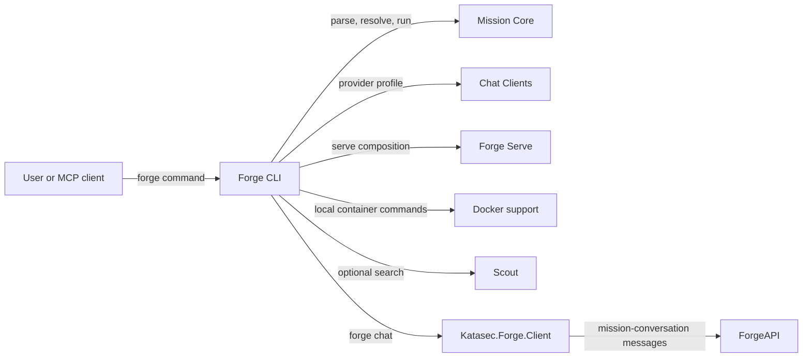

# Forge CLI

## Purpose

Exposes the `forge` executable and composes existing components into user-facing commands.

## Why this exists

People need one command surface for mission lifecycle, execution, serving, and supported local helpers. Keeping that surface thin prevents command handling from becoming a second owner of language, provider, or runtime behavior.

## Owns

- The executable entry point and command registration in [`Program`](Program.cs).
- Command input/output, mission-file selection, and composition of Core, Chat Clients, Docker, Scout, and Serve.
- CLI-specific OCI pulls, platform sign-in, built-in mission references, and MCP command wiring.
- The `forge chat` loop: the order of existing `Katasec.Forge.Client` calls and what is shown, as a full-screen TUI on a terminal or a line mode when piped.

## Does not own

- MCL syntax or execution semantics, provider SDK adaptation, Docker process protocol, web-search implementation, or HTTP wire mapping.

## Change admission

A change belongs here only if it advances the `forge` command surface or composes existing owners. For mission behavior change `ForgeMission.Core`; for provider construction, Docker control, search, or HTTP serving change the corresponding component rather than duplicating it in a command.

## Use these pieces

- [`Program`](Program.cs) registers every command and is the executable entry point.
- [`ForgeChat`](ForgeChat.cs) is `forge chat`: it opens the default Project (`~/Forge/Projects/chat`), publishes the naked `Chat` mission (`StarterMissions.ChatDefinition`: one expert `using anthropic`) on first use, reopens the latest conversation on the mode's mission (Chat, or ChatHands with `--hands`), so each mode keeps its own history, and creates one only when that mission has none (Janus conversations stay stored), and runs the chat, all through `ApplicationComposition` from `Katasec.Forge.Client`. It adds no ForgeAPI client of its own. When stdin and stdout are both terminals it opens the TUI; otherwise it keeps the plain type-and-print line mode that acceptance scripts pipe. The TUI needs a terminal that shows kitty images (Phase 56 G8), checked in two stages with one message: before sign-in or any network call, from XenoAtom's environment detection only (kitty graphics, not inside a multiplexer such as tmux, truecolor; nothing is sent to the terminal, so the `--hands` prompt and Ctrl-C behave as before); then on the TUI's first tick, the cell size from XenoAtom's probe, which XenoAtom's own input loop answers. If either stage fails, `forge chat` exits 1 with `forge chat needs a terminal that can show images, such as Ghostty or Kitty (not inside tmux). Open forge chat again from one of those.` The TUI runs one live stream from open to exit (Phase 53.9), so every turn streams in every window whichever window sent it; one turn runs at a time (Enter waits while any window's turn runs), Ctrl-C cancels only this window's own turn, and a stream that drops, fails, or stalls until HttpClient's timeout (a cancellation that is not the session's) reconnects from the cursor while a turn is in flight; a transport failure shows one `connection lost; reconnecting` line until the next event. With no turn in flight (none running in the conversation, from any window, and no reply pending here) an ended stream is not reopened (Phase 57 S5), so a forgotten window does not keep ForgeAPI awake: the TUI shows `idle — reconnects when you type`, and any key except Ctrl-D wakes it with a catch-up read from the saved cursor, then the live stream. An Enter that wakes it sends only after the catch-up, under the normal send rule. [`ChatLink`](Tui/ChatLink.cs) owns this connection state. Ctrl-D replaces the app's quit command so the stream and any busy call end on the live UI thread before the app stops. Only the TUI's stream asks for live reply deltas (Phase 53.8): a delta grows the latest card and the step's message replaces it, a delta never moves the cursor, and a delta is shown only after a step started on the same connection, so a reply joined mid-way shows no partial text until its final message. The line mode and replay stay whole-message. The line mode does not reconnect: a lost stream stops it with `chat failed: connection lost (<reason>)` on stderr and exit 1.
- `forge chat --hands` (Phase 55) lets the model read, write and edit files in the chat project folder through Bob (`ProjectWorkspace` profile; no terminal). It runs the separate `ChatHands` mission (`StarterMissions.ChatHandsDefinition` from `Katasec.Forge.Client`: the agent-role `Assistant` expert `using anthropic`, since Core gives tools only to agent experts; selected in [`ForgeChat`](ForgeChat.cs) as `ChatMode.Hands`), because a conversation's hands profile is pinned for life; plain `forge chat` stays on `Chat` with no hands, and switching mode opens a new conversation. Approval is once per project: without a published `ChatHands` version, a terminal run asks `Allow Forge to read, write and edit files in <folder>? [y/N]` before the TUI starts, and only a yes publishes `ChatHands` through the usual authoring flow. That published version in the project manifest is the persisted approval; later runs find it and do not ask. A piped run without it stops and says to run `forge chat --hands` in a terminal once. The client policy auto-approves the `file` capability only. After opening the conversation the CLI acknowledges the launch (attaching Bob); [`ChatHandsAttachment`](ChatHandsAttachment.cs) then executes each live `MissionHandsRequested` on the thread pool, off the follow loop (plus one check for a request already waiting); in the TUI only requests of the window's own turn execute, so another window's tool use is shown but not run, and Ctrl-C or exit while a file operation runs cancels the hands attempt first. Each tool use shows as one line, e.g. `Read notes.txt → succeeded`, in the TUI and the line mode.
- [`Tui/`](Tui) is the `forge chat` TUI on XenoAtom.Terminal.UI (Ghostty and Kitty; Shift+Enter needs the kitty keyboard protocol). [`Transcript`](Tui/Transcript.cs) is the one pure event→block mapping for replay and live turns (including the duplicate final reply); [`ChatScreen`](Tui/ChatScreen.cs) lays out the header, transcript, composer, and key bar; [`ChatTui`](Tui/ChatTui.cs) runs the live stream, submit, Ctrl-C cancel and Ctrl-D exit inside the UI loop, and as it starts discards keys typed before the TUI took the terminal ([`TypeAhead`](Tui/TypeAhead.cs), `tcflush`), so they never become composer text, and while it runs sets the terminal cursor (the composer caret) to the theme's `Caret` token, restoring the user's cursor colour on every exit ([`TerminalCaret`](Tui/TerminalCaret.cs), OSC 12/112); [`RawStdout`](Tui/RawStdout.cs) is the only code that writes raw escapes to stdout (kitty images, caret colour, pointer shape); [`ForgeTheme`](Tui/ForgeTheme.cs) holds the themes as data (`Light`, `Dark`: purpose-named colour tokens and shape values) and is the only file with colour literals; [`ForgeStyles`](Tui/ForgeStyles.cs) builds every component style, the XenoAtom theme, and the reply `MarkdownStyle` from one of them. Participant replies render as Markdown (XenoAtom.Terminal.UI.Extensions.Markdown, no syntax highlighting), parsed by [`ForgeMarkdown`](Tui/ForgeMarkdown.cs)'s pipelines: XenoAtom's configuration plus one step that turns a top-level h1–h3 with plain, allowed text into a fenced block marked `forge-heading-<per-process token>:N` (pending while a streaming reply's last heading has no newline after it; `ParticipantCard.Streaming` says a reply still streams); [`ForgeCodeBlockRenderer`](Tui/ForgeCodeBlockRenderer.cs) draws such a block as the heading in Inter (or its pending bold text, on the same two rows) and returns every other code block inside its tile frame (code-block tokens, no language label); it is created when the images arrive. Every shape is framed by image tiles (Phase 56): participant cards (one blank row above each, the border in the transcript's gutter column), code blocks, user messages (a capped pill on one row, a ring once the text wraps, at most 3/4 of the transcript wide and never left of the gutter), the header's APPROVED pill, tool (hands) lines as one-row chips on the gutter, and the composer (progress row, composer ring, one blank row, key bar, all on the gutter; [`ComposerEditor`](Tui/ComposerEditor.cs) measures its height at the width it is drawn at, which XenoAtom's `PromptEditor` caps at 48 columns). [`ScreenTiles`](Tui/ScreenTiles.cs) is the tile-set registry `ChatScreen` holds: eight sets (the card's hover edge since Task 5) and the two spinners' frames, drawn and sent once on the TUI's first tick (66 images). Proportional text (Phase 56 Task 4) is drawn as images in Inter: the brand (logo square and "forge"), the breadcrumb (`project / Mission`), each card's avatar and name, Markdown headings, the user's avatar after "You" (initial: the first letter of the local account name), the key-hint chips and the composer's send button. Text an image cannot carry (anything outside printable ASCII, Latin-1 letters and `· … → ↵ ⇧ – — ‘ ’ “ ”`, or a heading with code, emphasis or a link) stays bold terminal text. `ForgeChat` loads the embedded fonts before sign-in on the TUI path; a missing or unreadable font stops `forge chat` with `forge chat: <reason>` and exit 1.
- [`StartPage`](Tui/StartPage.cs) (Phase 60) is the TUI's first view: "Where do you want to start?" with **Create a mission** and **Chat with a mission** (the Desktop's one-line descriptions) on XenoAtom's `OptionList`. `ChatTui` shows it with `ChatScreen.ShowEditor(view, editor: false)` (in place of the transcript, composer hidden, chat key bar kept, Ctrl-D still quits) and focuses it on the first tick; the conversation opens behind it as before. **Chat with a mission** is selected; Enter or a click opens today's chat through `CloseEditor`. **Create a mission** does nothing. [`StartPageTests`](../../tests/ForgeMission.Mcl.Tests/Cli/StartPageTests.cs) drives a real `ChatTui`'s screen.
- `/edit <path>` (spike) opens a file in the TUI instead of sending a turn: [`EditFile`](Tui/EditFile.cs) holds the rules (the command, the path against the folder `forge chat` started in with a leading `~` as home, open existing or new, save without creating folders, the Esc guard) and [`FileEditor`](Tui/FileEditor.cs) the view (path row with `· new` until the first save, cut from the left with `…` when too long, XenoAtom's `CodeEditor` in a `ScrollViewer`, one message row; Ctrl+S saves, Esc closes, a second Esc discards unsaved changes). `ChatScreen.ShowEditor` puts it where the transcript is, hides the progress row and composer and shows `ctrl s save · esc close` in the key bar; while it is open `ChatTui`'s Ctrl-D, Ctrl-C and PgUp/PgDn stand aside, so Esc is the only way back. Syntax colours come from `CodeColours.EditorHighlighter` (TextMate grammar by extension, Light+/Dark+ from the screen theme). Typing in the editor wakes an idle link (accepted for the spike). [`FileEditorTests`](../../tests/ForgeMission.Mcl.Tests/Cli/FileEditorTests.cs) covers the rules, Go colours (on first paint: the editor's document is set before its highlighter, or colours built for the editor's empty version-0 document are kept until the first edit), the header's leading `…`, CRLF kept, the keys through a real XenoAtom app, and the screen swap.
- [`Tui/Graphics/`](Tui/Graphics) draws and sends the shape images, and only it builds pixels or writes images to the terminal. [`Raster`](Tui/Graphics/Raster.cs) renders shapes (signed-distance rounded rectangles, box-blur shadows, linear-light blending) and [`Png`](Tui/Graphics/Png.cs) encodes them on `System.IO.Compression`; [`RingGeometry`](Tui/Graphics/RingGeometry.cs) computes a ring shape's fit ring (shadow or glow plus the corner arc, in whole cells, with plain padding up to the shape's text inset) from its tokens and the cell size (1 mockup px = cell height ÷ 20; no rendering, no runtime check) and [`RingTiles`](Tui/Graphics/RingTiles.cs) cuts its eight tiles from one rendered template; [`CapTiles`](Tui/Graphics/CapTiles.cs) cuts the two 2-column caps of a one-row pill (half-round ends, an optional dot); [`TileSet`](Tui/Graphics/TileSet.cs) is one shape's tile set for the run, drawn at the cell size the terminal answered on the first tick, with image ids derived from theme, set and cell size (a cap set is a ring with no top or bottom rows); [`TileFrame`](Tui/Graphics/TileFrame.cs) is the one visual that paints a set's placeholder cells around content (for a user message it picks the cap set while the content is one row, else the ring); [`KittyImages`](Tui/Graphics/KittyImages.cs) builds the image escapes, written through `RawStdout` (kitty Unicode placeholders, [`PlaceholderDiacritics`](Tui/Graphics/PlaceholderDiacritics.cs)); [`TerminalFacts`](Tui/Graphics/TerminalFacts.cs) reads the terminal facts (the environment before sign-in, the cell size inside the TUI) and holds the two G8 decisions on them. Text images: [`GlyphText`](Tui/Graphics/GlyphText.cs) is the one adapter over StbTrueTypeSharp and the only file with unsafe code (glyph coverage, metrics); [`GposKerning`](Tui/Graphics/GposKerning.cs) reads the font's GPOS pair kerning (PairPos formats 1 and 2, Extension lookups, Coverage 1/2, ClassDef 1/2), which Stb does not; [`TextArt`](Tui/Graphics/TextArt.cs) holds the allowed-text rule, wraps headings and draws each text image at the cell size (text blended in sRGB on light, linear light on dark); [`TextImages`](Tui/Graphics/TextImages.cs) is the session's cache: an image is drawn and sent the first time it is asked for, on the UI thread (`KittyImages.Transmit` asserts it), with an id of bit 23 plus a stable 23-bit hash of (theme, cell size, kind, text), probing on a clash; [`ImageCells`](Tui/Graphics/ImageCells.cs) and [`HeadingImage`](Tui/Graphics/HeadingImage.cs) paint their placeholder cells. The fonts are Inter 4.1 SemiBold and Bold subset to the allowed set (kerning only, no hinting, no GSUB, about 22 KB each) with their OFL licence, in [`Tui/Graphics/Fonts`](Tui/Graphics/Fonts), embedded; they and the kerning golden tables are made by [`eng/fonts/inter-subset.sh`](../../eng/fonts/inter-subset.sh) (`hb-subset  --unicodes=20-7E,C0-D6,D8-F6,F8-FF,B7,2026,2192,21B5,21E7,2013,2014,2018,2019,201C,201D --layout-features=kern --no-hinting --drop-tables+=GSUB --name-IDs+=13,14`, HarfBuzz 12.1.0). Every visual value, including radii, hairlines, shadows, the composer glow and the mockup layout numbers, is a `ForgeTheme` token or constant.
- Motion (Phase 56 Task 5). Each reply body carries three overlays drawn after it: [`FadeIn`](Tui/FadeIn.cs) fades in the cells a live delta changed (each cell on its own 220 ms clock, from its background to its colour, CSS ease-out mixed in sRGB; image placeholder cells are never touched), [`StreamCaret`](Tui/StreamCaret.cs) blinks an `Accent` `█` after the last text cell while the reply is pending or streams, and a [`LinkPointer`](Tui/LinkPointer.cs) probe records which cells carry a link, so the pointer is a hand over links (OSC 22, written only when it changes; [`TerminalPointer`](Tui/TerminalPointer.cs) puts the default back on every exit, inside the caret colour's restore). A card's frame paints a hover edge (`Border` hairline, tile set 7) while the pointer is over it. The progress row ("X is replying …", kept while the reply streams by `Transcript.Streaming`) and a running tool chip (in place of its ` …`, TUI only) show a spinner ([`SpinnerCells`](Tui/Graphics/SpinnerCells.cs)): 10 image frames per spinner drawn and sent once at start-up ([`SpinnerFrames`](Tui/Graphics/SpinnerFrames.cs), ids with bit 22 set), cycled every 80 ms, on screen only while a reply is in flight. [`Motion`](Tui/Motion.cs) holds the timing and colour rules. Nothing animates on an idle screen. [`XenoCells`](Tui/XenoCells.cs) is the only code that touches XenoAtom internals (a Type-2 exception: a cell read, the clip rectangle, `RequestAnimation`, through `[UnsafeAccessor]`, pinned to XenoAtom 3.10.0; it goes when XenoAtom exposes public cell reads and hit-testing). Start-up images: 66 (38 tiles + 8 hover tiles + 20 spinner frames).
- [`ForgeConfig`](ForgeConfig.cs) reads `~/.forge/config.json` once at startup: `{ "theme": "light" | "dark" }`, dark when the file or key is missing (Phase 56 G10); an unknown theme or invalid JSON stops `forge chat` (both modes) with an error.
- [`ForgeExec`](ForgeExec.cs) is the shared CLI execution helper; [`ProviderClientBuilder`](ProviderClientBuilder.cs) wires optional live search.
- [`ChatClients`](../ForgeMission.ChatClients/ChatClients.cs), [`ForgeServe`](../ForgeMission.Serve/ForgeServe.cs), and [`DockerCli`](../ForgeMission.Docker/DockerCli.cs) are composed owners.
- [`ChatTranscriptTests`](../../tests/ForgeMission.Mcl.Tests/Cli/ChatTranscriptTests.cs) covers the transcript mapping (including live deltas and hands lines), the stream loop's delta gating, cursor and reconnect, another window's pending reply, the own-turn hands rule, the turn-running rule, and the TUI/line-mode switch. [`ForgeChatTests`](../../tests/ForgeMission.Mcl.Tests/Cli/ForgeChatTests.cs) covers turn end, conversation reuse per mode, the `--hands` flag, policy per mode, mission selection, the approval prompt, and both G8 terminal decisions (environment, cell size). [`TileSetTests`](../../tests/ForgeMission.Mcl.Tests/Cli/TileSetTests.cs) checks every ring set (no seam, shadow faded or corner on the surface, plain interior) and every cap set (no step where the cap meets its text, the APPROVED dot) for every cell height 12–60 px at widths 0.40–0.60 × the height in both themes, the designed sizes on both displays, and the image ids (disjoint per theme, set and cell size, stable). [`ChatScreenTileTests`](../../tests/ForgeMission.Mcl.Tests/Cli/ChatScreenTileTests.cs) renders the real screen off screen and reads which tile or text image sits in each cell: the card, a one-line and a wrapped user message, tool chips, the APPROVED pill, the composer and the bottom spacing, code blocks in lists and quotes, narrow windows, the brand and breadcrumb, card avatars and names (and a name in another script as text), a streamed heading switching from text to image on the same rows, and each text image sent once. [`GposKerningTests`](../../tests/ForgeMission.Mcl.Tests/Cli/GposKerningTests.cs) checks the kerning reader against HarfBuzz's golden tables (every pair in the allowed set, both weights, tied to the font's SHA-256); [`GlyphTextTests`](../../tests/ForgeMission.Mcl.Tests/Cli/GlyphTextTests.cs) the embedded fonts, the allowed set and the font-failure exit; [`TextArtTests`](../../tests/ForgeMission.Mcl.Tests/Cli/TextArtTests.cs) every text image's edges and sizes over the cell-size range; [`TextImagesTests`](../../tests/ForgeMission.Mcl.Tests/Cli/TextImagesTests.cs) send-once, ids and clashes; [`HeadingRouteTests`](../../tests/ForgeMission.Mcl.Tests/Cli/HeadingRouteTests.cs) which headings become images; [`KittyImagesThreadTests`](../../tests/ForgeMission.Mcl.Tests/Cli/KittyImagesThreadTests.cs) that a transmit off the UI thread throws. [`ForgeConfigTests`](../../tests/ForgeMission.Mcl.Tests/Cli/ForgeConfigTests.cs) covers theme selection; [`ForgeMarkdownStyleTests`](../../tests/ForgeMission.Mcl.Tests/Cli/ForgeMarkdownStyleTests.cs) covers the Markdown slot and code-block tokens; [`TuiColourLiteralTests`](../../tests/ForgeMission.Mcl.Tests/Cli/TuiColourLiteralTests.cs) fails on a colour literal or raw RGB/RGBA byte literal anywhere under `Tui/` outside `ForgeTheme` (one exception: `KittyImages`' image-id colour), and on any stdout writer under `Tui/` (`Console.Out`, `Console.Write`, `Terminal.Write`, raw stdout) other than `RawStdout`, and on StbTrueTypeSharp or unsafe code anywhere in the CLI outside `GlyphText`. [`TerminalCaretTests`](../../tests/ForgeMission.Mcl.Tests/Cli/TerminalCaretTests.cs) covers the caret token and the cursor colour being restored when the TUI ends normally or throws. Motion (Task 5): [`ChatScreenMotionTests`](../../tests/ForgeMission.Mcl.Tests/Cli/ChatScreenMotionTests.cs) renders the real screen with a test clock (a delta fades only the cells it changed, each on its own clock; placeholders are never restyled; the caret; the progress and tool-chip spinners only while a reply is in flight; the hover edge; link cells and the pointer escapes; an idle screen asks for no frames); [`MotionTests`](../../tests/ForgeMission.Mcl.Tests/Cli/MotionTests.cs) the timing and colour rules; [`SpinnerFramesTests`](../../tests/ForgeMission.Mcl.Tests/Cli/SpinnerFramesTests.cs) the frames over the cell-size range and their ids; [`TerminalPointerTests`](../../tests/ForgeMission.Mcl.Tests/Cli/TerminalPointerTests.cs) the pointer reset on each exit; [`XenoInternalsContractTests`](../../tests/ForgeMission.Mcl.Tests/Cli/XenoInternalsContractTests.cs) pins XenoCells' internals and the XenoAtom behaviour they rely on to 3.10.0, and `TuiColourLiteralTests` fails on `[UnsafeAccessor]` outside `XenoCells`. [`TuiQuitContractTests`](../../tests/ForgeMission.Mcl.Tests/Cli/TuiQuitContractTests.cs) pins the XenoAtom behaviour the Ctrl-D exit relies on (a replaced quit command keeps the app running; an update step returning `Stop` ends it).
- [`MissionFileResolutionTests`](../../tests/ForgeMission.Mcl.Tests/Cli/MissionFileResolutionTests.cs) covers CLI mission-file defaulting.

## Communicates with

## Important flows and constraints

- The published executable is Native AOT; preserve source-generated and reflection-safety requirements in its dependency graph.
- `Program` is composition code, not a home for provider or pipeline business logic.
- CLI defaults and command semantics are part of the public product surface; keep errors and argument handling explicit.

## Related documentation

- [CLI architecture](https://github.com/katasec/mission-control-language/blob/main/docs/design/architecture.md)
- [MCL language](https://github.com/katasec/mission-control-language/blob/main/docs/design/language.md)
- [Build](https://github.com/katasec/forge-mcl/blob/main/README.md#build)
