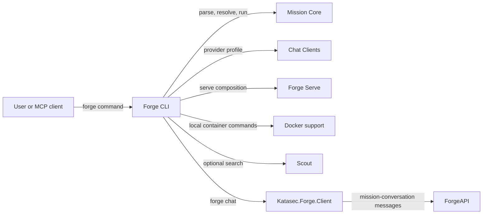

# Forge CLI

## Purpose

Exposes the `forge` executable and composes existing components into user-facing commands.

## Why this exists

People need one command surface for mission lifecycle, execution, serving, and supported local helpers. Keeping that surface thin prevents command handling from becoming a second owner of language, provider, or runtime behavior.

## Owns

- The executable entry point and command registration in [`Program`](Program.cs).
- Command input/output, mission-file selection, and composition of Core, Chat Clients, Docker, Scout, and Serve.
- CLI-specific OCI pulls, platform sign-in, built-in mission references, and MCP command wiring.
- The `forge chat` loop: the order of existing `Katasec.Forge.Client` calls and what is shown, as a full-screen TUI on a terminal or a line mode when piped.

## Does not own

- MCL syntax or execution semantics, provider SDK adaptation, Docker process protocol, web-search implementation, or HTTP wire mapping.

## Change admission

A change belongs here only if it advances the `forge` command surface or composes existing owners. For mission behavior change `ForgeMission.Core`; for provider construction, Docker control, search, or HTTP serving change the corresponding component rather than duplicating it in a command.

## Use these pieces

- [`Program`](Program.cs) registers every command and is the executable entry point.
- [`ForgeChat`](ForgeChat.cs) is `forge chat`: it opens the default Project (`~/Forge/Projects/chat`), publishes the naked `Chat` mission (`StarterMissions.ChatDefinition`: one expert `using anthropic`) on first use, reopens the latest conversation on the mode's mission (Chat, or ChatHands with `--hands`), so each mode keeps its own history, and creates one only when that mission has none (Janus conversations stay stored), and runs the chat, all through `ApplicationComposition` from `Katasec.Forge.Client`. It adds no ForgeAPI client of its own. When stdin and stdout are both terminals it opens the TUI; otherwise it keeps the plain type-and-print line mode that acceptance scripts pipe. The TUI needs a terminal that shows kitty images (Phase 56 G8), checked in two stages with one message: before sign-in or any network call, from XenoAtom's environment detection only (kitty graphics, not inside a multiplexer such as tmux, truecolor; nothing is sent to the terminal, so the `--hands` prompt and Ctrl-C behave as before); then on the TUI's first tick, the cell size from XenoAtom's probe, which XenoAtom's own input loop answers. If either stage fails, `forge chat` exits 1 with `forge chat needs a terminal that can show images, such as Ghostty or Kitty (not inside tmux). Open forge chat again from one of those.` The TUI runs one live stream from open to exit (Phase 53.9), so every turn streams in every window whichever window sent it; one turn runs at a time (Enter waits while any window's turn runs), Ctrl-C cancels only this window's own turn, and a stream that drops, fails, or stalls until HttpClient's timeout (a cancellation that is not the session's) reconnects from the cursor while a turn is in flight; a transport failure shows one `connection lost; reconnecting` line until the next event. With no turn in flight (none running in the conversation, from any window, and no reply pending here) an ended stream is not reopened (Phase 57 S5), so a forgotten window does not keep ForgeAPI awake: the TUI shows `idle — reconnects when you type`, and any key except Ctrl-D wakes it with a catch-up read from the saved cursor, then the live stream. An Enter that wakes it sends only after the catch-up, under the normal send rule. [`ChatLink`](Tui/ChatLink.cs) owns this connection state. Ctrl-D replaces the app's quit command so the stream and any busy call end on the live UI thread before the app stops. Only the TUI's stream asks for live reply deltas (Phase 53.8): a delta grows the latest card and the step's message replaces it, a delta never moves the cursor, and a delta is shown only after a step started on the same connection, so a reply joined mid-way shows no partial text until its final message. The line mode and replay stay whole-message. The line mode does not reconnect: a lost stream stops it with `chat failed: connection lost (<reason>)` on stderr and exit 1.
- `forge chat --hands` (Phase 55) lets the model read, write and edit files in the chat project folder through Bob (`ProjectWorkspace` profile; no terminal). It runs the separate `ChatHands` mission (`StarterMissions.ChatHandsDefinition` from `Katasec.Forge.Client`: the agent-role `Assistant` expert `using anthropic`, since Core gives tools only to agent experts; selected in [`ForgeChat`](ForgeChat.cs) as `ChatMode.Hands`), because a conversation's hands profile is pinned for life; plain `forge chat` stays on `Chat` with no hands, and switching mode opens a new conversation. Approval is once per project: without a published `ChatHands` version, a terminal run asks `Allow Forge to read, write and edit files in <folder>? [y/N]` before the TUI starts, and only a yes publishes `ChatHands` through the usual authoring flow. That published version in the project manifest is the persisted approval; later runs find it and do not ask. A piped run without it stops and says to run `forge chat --hands` in a terminal once. The client policy auto-approves the `file` capability only. After opening the conversation the CLI acknowledges the launch (attaching Bob); [`ChatHandsAttachment`](ChatHandsAttachment.cs) then executes each live `MissionHandsRequested` on the thread pool, off the follow loop (plus one check for a request already waiting); in the TUI only requests of the window's own turn execute, so another window's tool use is shown but not run, and Ctrl-C or exit while a file operation runs cancels the hands attempt first. Each tool use shows as one line, e.g. `Read notes.txt → succeeded`, in the TUI and the line mode.
- [`Tui/`](Tui) is the `forge chat` TUI on XenoAtom.Terminal.UI (Ghostty and Kitty; Shift+Enter needs the kitty keyboard protocol). [`Transcript`](Tui/Transcript.cs) is the one pure event→block mapping for replay and live turns (including the duplicate final reply); [`ChatScreen`](Tui/ChatScreen.cs) lays out the header, transcript, composer, and key bar; [`ChatTui`](Tui/ChatTui.cs) runs the live stream, submit, Ctrl-C cancel and Ctrl-D exit inside the UI loop; [`ForgeTheme`](Tui/ForgeTheme.cs) holds the themes as data (`Light`, `Dark`: purpose-named colour tokens and the pill cap glyphs) and is the only file with colour literals; [`ForgeStyles`](Tui/ForgeStyles.cs) builds every component style, the XenoAtom theme, and the reply `MarkdownStyle` from one of them. Participant replies render as Markdown (XenoAtom.Terminal.UI.Extensions.Markdown, no syntax highlighting); [`ForgeCodeBlockRenderer`](Tui/ForgeCodeBlockRenderer.cs) draws code blocks as a rounded box in the code-block tokens with no language label. Participant cards are framed by image tiles (Phase 56): one blank row above each, the border in the transcript's gutter column.
- [`Tui/Graphics/`](Tui/Graphics) draws and sends the card edge images, and only it builds pixels or writes images to the terminal. [`Raster`](Tui/Graphics/Raster.cs) renders shapes (signed-distance rounded rectangles, box-blur shadows, linear-light blending) and [`Png`](Tui/Graphics/Png.cs) encodes them on `System.IO.Compression`; [`RingGeometry`](Tui/Graphics/RingGeometry.cs) computes the fit ring from the card tokens and the cell size (1 mockup px = cell height ÷ 20; no rendering, no runtime check) and [`CardTiles`](Tui/Graphics/CardTiles.cs) cuts its eight tiles from one rendered template card; [`CardRing`](Tui/Graphics/CardRing.cs) is the run's one tile set, drawn and sent once on the TUI's first tick at the cell size the terminal answered there, with image ids derived from theme and cell size; [`CardFrame`](Tui/Graphics/CardFrame.cs) is the card visual that paints the tile placeholder cells around a card's content; [`KittyImages`](Tui/Graphics/KittyImages.cs) is the only writer of images to stdout (kitty Unicode placeholders, [`PlaceholderDiacritics`](Tui/Graphics/PlaceholderDiacritics.cs)); [`TerminalFacts`](Tui/Graphics/TerminalFacts.cs) reads the terminal facts (the environment before sign-in, the cell size inside the TUI) and holds the two G8 decisions on them. Every visual value, including the card radius, hairline, shadows and the mockup layout numbers, is a `ForgeTheme` token or constant.
- [`ForgeConfig`](ForgeConfig.cs) reads `~/.forge/config.json` once at startup: `{ "theme": "light" | "dark" }`, dark when the file or key is missing (Phase 56 G10); an unknown theme or invalid JSON stops `forge chat` (both modes) with an error.
- [`ForgeExec`](ForgeExec.cs) is the shared CLI execution helper; [`ProviderClientBuilder`](ProviderClientBuilder.cs) wires optional live search.
- [`ChatClients`](../ForgeMission.ChatClients/ChatClients.cs), [`ForgeServe`](../ForgeMission.Serve/ForgeServe.cs), and [`DockerCli`](../ForgeMission.Docker/DockerCli.cs) are composed owners.
- [`ChatTranscriptTests`](../../tests/ForgeMission.Mcl.Tests/Cli/ChatTranscriptTests.cs) covers the transcript mapping (including live deltas and hands lines), the stream loop's delta gating, cursor and reconnect, another window's pending reply, the own-turn hands rule, the turn-running rule, and the TUI/line-mode switch. [`ForgeChatTests`](../../tests/ForgeMission.Mcl.Tests/Cli/ForgeChatTests.cs) covers turn end, conversation reuse per mode, the `--hands` flag, policy per mode, mission selection, the approval prompt, and both G8 terminal decisions (environment, cell size). [`CardEdgeTests`](../../tests/ForgeMission.Mcl.Tests/Cli/CardEdgeTests.cs) checks the card tiles (no seam, shadow faded at the ring's edge, plain interior) for every cell height 12–60 px at widths 0.40–0.60 × the height in both themes, and the image ids (disjoint per theme and cell size, stable). [`ForgeConfigTests`](../../tests/ForgeMission.Mcl.Tests/Cli/ForgeConfigTests.cs) covers theme selection; [`ForgeMarkdownStyleTests`](../../tests/ForgeMission.Mcl.Tests/Cli/ForgeMarkdownStyleTests.cs) covers the Markdown slot and code-block tokens; [`TuiColourLiteralTests`](../../tests/ForgeMission.Mcl.Tests/Cli/TuiColourLiteralTests.cs) fails on a colour literal or raw RGB/RGBA byte literal anywhere under `Tui/` outside `ForgeTheme` (one exception: `KittyImages`' image-id colour), and on any stdout writer under `Tui/` (`Console.Out`, `Console.Write`, `Terminal.Write`, raw stdout) other than `KittyImages`' raw stdout. [`TuiQuitContractTests`](../../tests/ForgeMission.Mcl.Tests/Cli/TuiQuitContractTests.cs) pins the XenoAtom behaviour the Ctrl-D exit relies on (a replaced quit command keeps the app running; an update step returning `Stop` ends it).
- [`MissionFileResolutionTests`](../../tests/ForgeMission.Mcl.Tests/Cli/MissionFileResolutionTests.cs) covers CLI mission-file defaulting.

## Communicates with

## Important flows and constraints

- The published executable is Native AOT; preserve source-generated and reflection-safety requirements in its dependency graph.
- `Program` is composition code, not a home for provider or pipeline business logic.
- CLI defaults and command semantics are part of the public product surface; keep errors and argument handling explicit.

## Related documentation

- [CLI architecture](https://github.com/katasec/mission-control-language/blob/main/docs/design/architecture.md)
- [MCL language](https://github.com/katasec/mission-control-language/blob/main/docs/design/language.md)
- [Build](https://github.com/katasec/forge-mcl/blob/main/README.md#build)
