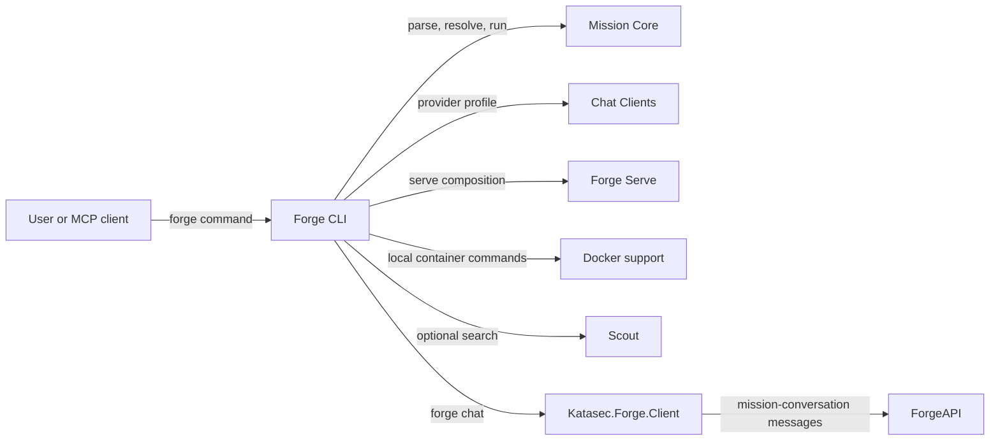

# Forge CLI

## Purpose

Exposes the `forge` executable and composes existing components into user-facing commands.

## Why this exists

People need one command surface for mission lifecycle, execution, serving, and supported local helpers. Keeping that surface thin prevents command handling from becoming a second owner of language, provider, or runtime behavior.

## Owns

- The executable entry point and command registration in [`Program`](Program.cs).
- Command input/output, mission-file selection, and composition of Core, Chat Clients, Docker, Scout, and Serve.
- CLI-specific OCI pulls, platform sign-in, built-in mission references, and MCP command wiring.
- The `forge chat` loop: the order of existing `Katasec.Forge.Client` calls and what is shown, as a full-screen TUI on a terminal or a line mode when piped.

## Does not own

- MCL syntax or execution semantics, provider SDK adaptation, Docker process protocol, web-search implementation, or HTTP wire mapping.

## Change admission

A change belongs here only if it advances the `forge` command surface or composes existing owners. For mission behavior change `ForgeMission.Core`; for provider construction, Docker control, search, or HTTP serving change the corresponding component rather than duplicating it in a command.

## Use these pieces

- [`Program`](Program.cs) registers every command and is the executable entry point.
- [`ForgeChat`](ForgeChat.cs) is `forge chat`: it opens the default Project (`~/Forge/Projects/chat`), publishes the naked `Chat` mission (`StarterMissions.ChatDefinition`: one expert `using anthropic`) on first use, reopens the latest mission conversation only when it is on Chat (otherwise creates one on Chat; Janus conversations stay stored), and runs the chat, all through `ApplicationComposition` from `Katasec.Forge.Client`. It adds no ForgeAPI client of its own. When stdin and stdout are both terminals it opens the TUI; otherwise it keeps the plain type-and-print line mode that acceptance scripts pipe. Only the TUI's follow asks for live reply deltas (Phase 53.8): a delta grows the latest card and the step's message replaces it, a delta never moves the cursor, and a delta is shown only after a step started on the same connection, so a reply joined mid-way shows no partial text until its final message. The line mode and replay stay whole-message.
- [`Tui/`](Tui) is the `forge chat` TUI on XenoAtom.Terminal.UI (Ghostty and Kitty; Shift+Enter needs the kitty keyboard protocol). [`Transcript`](Tui/Transcript.cs) is the one pure event→block mapping for replay and live turns (including the duplicate final reply); [`ChatScreen`](Tui/ChatScreen.cs) lays out the header, transcript, composer, and key bar; [`ChatTui`](Tui/ChatTui.cs) runs submit, follow, and Ctrl-C cancel inside the UI loop; [`ForgeTheme`](Tui/ForgeTheme.cs) holds the themes as data (`Light`, `Dark`: purpose-named colour tokens and the pill cap glyphs) and is the only file with colour literals; [`ForgeStyles`](Tui/ForgeStyles.cs) builds every component style, the XenoAtom theme, and the reply `MarkdownStyle` from one of them. Participant replies render as Markdown (XenoAtom.Terminal.UI.Extensions.Markdown, no syntax highlighting); [`ForgeCodeBlockRenderer`](Tui/ForgeCodeBlockRenderer.cs) draws code blocks as a rounded box in the code-block tokens with no language label.
- [`ForgeConfig`](ForgeConfig.cs) reads `~/.forge/config.json` once at startup: `{ "theme": "light" | "dark" }`, light when the file or key is missing; an unknown theme or invalid JSON stops `forge chat` (both modes) with an error.
- [`ForgeExec`](ForgeExec.cs) is the shared CLI execution helper; [`ProviderClientBuilder`](ProviderClientBuilder.cs) wires optional live search.
- [`ChatClients`](../ForgeMission.ChatClients/ChatClients.cs), [`ForgeServe`](../ForgeMission.Serve/ForgeServe.cs), and [`DockerCli`](../ForgeMission.Docker/DockerCli.cs) are composed owners.
- [`ChatTranscriptTests`](../../tests/ForgeMission.Mcl.Tests/Cli/ChatTranscriptTests.cs) covers the transcript mapping (including live deltas), the follow loop's delta gating and cursor, and the TUI/line-mode switch. [`ForgeConfigTests`](../../tests/ForgeMission.Mcl.Tests/Cli/ForgeConfigTests.cs) covers theme selection; [`ForgeMarkdownStyleTests`](../../tests/ForgeMission.Mcl.Tests/Cli/ForgeMarkdownStyleTests.cs) covers the Markdown slot and code-block tokens; [`TuiColourLiteralTests`](../../tests/ForgeMission.Mcl.Tests/Cli/TuiColourLiteralTests.cs) fails on a colour literal outside `ForgeTheme`.
- [`MissionFileResolutionTests`](../../tests/ForgeMission.Mcl.Tests/Cli/MissionFileResolutionTests.cs) covers CLI mission-file defaulting.

## Communicates with

## Important flows and constraints

- The published executable is Native AOT; preserve source-generated and reflection-safety requirements in its dependency graph.
- `Program` is composition code, not a home for provider or pipeline business logic.
- CLI defaults and command semantics are part of the public product surface; keep errors and argument handling explicit.

## Related documentation

- [CLI architecture](../../docs/design/architecture.md)
- [MCL language](../../docs/design/language.md)
- [Release workflow](../../AGENTS.md#release-workflow)
