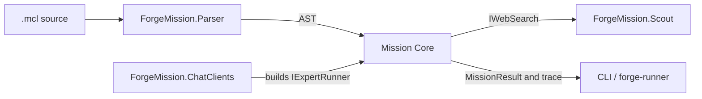

# Mission Core

## Purpose

Supplies the provider-neutral implementation of MCL mission loading, resolution, and execution, plus reusable contracts and primitives shared by hosts.

## Why this exists

Mission semantics must be executable without coupling the language runtime to a particular provider, executable host, or Desktop domain. This project keeps those durable semantics and shared primitives in one AOT-compatible library.

## Owns

- Expert definitions and loading, mission/lock-file resolution, and `forge.toml` manifest reading.
- Pipeline execution, trace/result contracts, and the provider-neutral [`IExpertRunner`](Runtime/IExpertRunner.cs) seam.
- Reusable workspace and capability contracts, dispatch primitives, and tool executors.

## Does not own

- Provider SDK selection or credentials, command-line UX, HTTP serving, Project/conversation state, or Desktop process supervision.
- The scoped local-capability authority: Client Runtime (Bob) composes these capability primitives and owns its policy, admission, confirmation, audit, and lifetime.

## Change admission

A change belongs here only if it advances provider-neutral MCL execution, resolution, or a reusable contract/primitives boundary. For provider construction change `ForgeMission.ChatClients`; for scoped local capability authority compose with `ForgeMission.ClientRuntime`.

## Use these pieces

- [`PipelineRunner`](Runtime/PipelineRunner.cs) is the one MCL interpreter: it executes a parsed mission with resolved experts and named runners. With root tools a run pauses on an agent's declared tool call at any depth, without holding capability authority; `ResumeAsync` replays the checkpoint's log of completed steps and continues the paused agent's tool turn.
- [`PipelineRunOptions.StreamLlmDeltas`](Runtime/PipelineRunOptions.cs) (set only by a durable executor) streams each tool-free, non-judge llm step and emits its chunks as `PipelineStepDelta` trace facts; the step completes with its plain text as a pass. Judges, steps with tools attached, and parallel steps keep `RunAsync`. One helper in `PipelineRunner` decides streaming.
- [`PipelineRunOptions.ChatHistory`](Runtime/ChatHistory.cs) carries a durable chat's earlier turns as user/assistant messages; every llm step of the root mission sends `system + history + user(step input)`; step 1's input is the root mission's first declared parameter (the new message), not "Begin.". Child missions get none, it is never checkpointed (pass it again on resume), and a tool step with a client `conversation` as well is refused. `context["conversation"]` (forge serve) is unchanged.
- [`IExpertRunner`](Runtime/IExpertRunner.cs) is the only runner abstraction used by the pipeline.
- [`ExpertResolver`](Resolution/ExpertResolver.cs), [`ExpertLoader`](Experts/ExpertLoader.cs), and [`ForgeTomlReader`](Manifest/ForgeTomlReader.cs) provide the resolution inputs.
- [`DurableMissionPackageValidator`](Runtime/DurableMissionPackageValidator.cs) constructs and validates resolved package values without reading files, credentials or environment expressions. `TryCreate` selects the first mission and its first parameter (empty for a parameterless root). `TryValidateInputNames` checks required root parameters and reachable declared expert inputs. Validated output reports sorted `AdmittedInputNames` and actual `ProviderProfileNames`; deployment owns provider availability.
- [`PipelineRunnerTests`](https://github.com/katasec/forge-mcl/blob/main/tests/ForgeMission.Mcl.Tests/Runtime/PipelineRunnerTests.cs) and [`CapabilityDispatcherTests`](https://github.com/katasec/forge-mcl/blob/main/tests/ForgeMission.Mcl.Tests/Tools/CapabilityDispatcherTests.cs) cover execution and capability contracts.

## Communicates with

## Important flows and constraints

- Core 0.1.8 adds explicit `DurableMissionAssetInput` values (canonical relative path, content type, bytes, SHA-256 and executable bit). The actual source-generated camelCase JSON value must fit 4 MiB, including base64/escaping. Assets cannot collide with staged metadata/expert files or use runtime `inputs/` and `outputs/` paths. A package does not authorize a filesystem scan. Empty/missing assets retain format-1 hashes. The retained six-argument package constructor serves already-published clients; `JsonConstructor` selects the seven-argument semantic constructor for generated deserialization.
- `ForgeTomlReader.TryReadDistribution` shares the normal TOML parser but selects only literal expert locators and package assets before environment evaluation. `TryRead` remains the full local configuration reader. Package admission rejects all authored environment expressions and exact reserved credential/runtime names; declared `token_count` is an ordinary input. Expert inputs are forwarded when present, not a new mandatory schema; root parameters are required.
- Root-tool checkpoints derive admitted names from root parameters/reachable expert inputs and retain only those values. Inner format 3 checks that set and the complete execution-semantic fingerprint before replay; envelope 1 remains. Old inner formats are refused. Scratch roots and `ExpertDirectory` do not affect identity; completed side effects replay from the log. Opaque authored text is never rewritten for paths.
- `PipelineRunOptions.ExecutionWorkspace` is runtime-only and inherited by child missions. Its verified artifact registry maps root-relative paths to digests and retains the supplied live caller/Runner-owned concurrent dictionary through `IReadOnlyDictionary`; later registrations are visible without replacing the workspace. Core does not register or freeze artifacts. Exec makes matching declared input values absolute only in its process copy, keeps expert-relative cwd and literal args, and supplies runtime directory/stdin/environment bindings. `GetStepOutputDirectory` calculates `outputs/<SHA256-of-StepKey>/<attempt>` without I/O. Every emitted lifecycle trace exposes that exact internal `StepKey`.
- Exec concurrently exchanges bounded stdin/stdout (4 MiB each) and stderr (64 KiB). It owns a POSIX group before execution and retains its unreaped root through cleanup, or associates a Windows job before execution. Early root exit does not release descendant ownership. Cleanup joins I/O/native observation and reaps owned Linux adopted children, excluding unrelated children; observed cleanup failure remains IOException even during caller cancellation. Closed unread stdin alone is allowed; other I/O failures remain visible. Remaining process environment/identity is inherited; this is lifecycle management, not a sandbox. Programs returning reusable file paths must use paths relative to `FORGE_WORK_DIR`. Runtime bindings never enter checkpoint context by injection.
- ONNX retains numeric classifier semantics and expert-relative model resolution. Awaited native loading/inference permits sibling branch launch, uses native termination on cancellation and joins before disposing session/options/results. Tests execute numeric identity and cancellable Loop graphs; actual image/cloud support remains the consuming Runner's acceptance responsibility.

- The parser only establishes syntax; expert resolution is eager and fails before execution.
- The pipeline selects a named runner per `using` profile and never takes provider-specific types.
- AOT callers must retain source-generated JSON and the existing reflection-preservation rules; do not introduce runtime reflection as a convenience.

## Related documentation

- [Architecture](https://github.com/katasec/mission-control-language/blob/main/docs/design/architecture.md)
- [Language design](https://github.com/katasec/mission-control-language/blob/main/docs/design/language.md)
- [Phase 43.23 ownership end state](https://github.com/katasec/mission-control-language/blob/main/docs/retrospectives/phase-43-domain-ownership/end-state.md)
