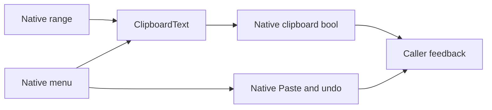

# Forge Terminal Extensions

## Why

Forge needs truthful clipboard results and fixed native context menus while retaining XenoAtom's
selection, editing, rendering, clipboard transport and undo.

## Owns

Selection extraction and clipboard result vocabulary; fixed editor Copy/Paste and Paragraph
Copy menus; invocation attachment, eligibility and content guards; observation of native Paste reads.

## Does not own

XenoAtom.Terminal.UI owns native editing, ranges, input routing, focus and popup lifetime.
XenoAtom.Terminal owns clipboard transport and backends. The CLI owns source coordination,
Copy versus Stop, themes/status and snippet composition.

## Change admission

Changes must preserve the pinned public XenoAtom contract and native insertion/undo. No reflection,
private access, compatibility route or new backend. Verify failure and stale-target paths, the packed
public consumer and Native AOT before publication.

## API

Package and namespace: `Katasec.Forge.Terminal.Extensions`; assembly: `ForgeMission.Terminal.Extensions`.
Dependencies are exactly XenoAtom.Terminal.UI 3.10.0 and XenoAtom.Terminal 2.2.0.

`ClipboardText.CopySelection(ISelectionOwner, TerminalInstance)` returns NoSelection, Copied or
CopyFailed. `CopyText(string, TerminalInstance)` copies exact text, including empty strings.
`TextEditorBase.ConfigureClipboard(Action<ClipboardResult>)` and
`Paragraph.ConfigureClipboard(Action<ClipboardResult>)` configures the fixed native Paragraph menu.
Its overload accepting availability and copy callbacks lets a caller retain exact selection composition
while this package retains the popup, stale-target and clipboard-result contract.
The editor additionally reports PasteReadSucceeded/PasteReadFailed without taking insertion ownership.
Configure editors once before attachment. Paragraph configuration replaces its factory.
Callbacks report synchronous facts and must not mutate editing, focus, menus or the visual tree.

## Build and package

From the repository root: `make test-terminal-extensions`, `make pack-terminal-extensions`,
`make verify-terminal-extensions-package`. Publication uses the package-specific workflow after
merge, with immutable version and committed source provenance.
The package workflow verifies pull requests on macOS-14 with read-only permissions, full tests,
packing and warning-free native CLI checks. Tag/manual publication depends on that verification.
